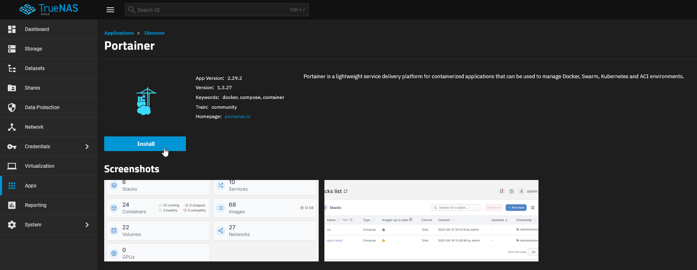
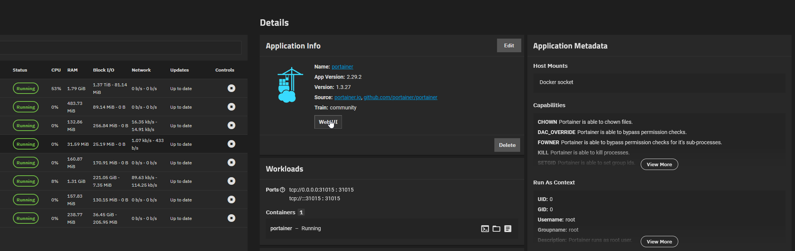
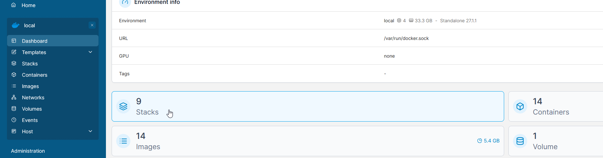
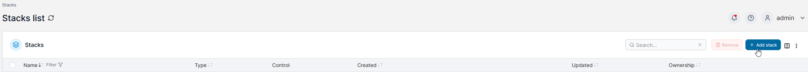
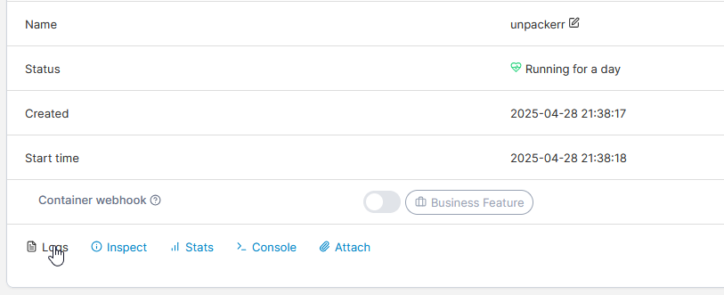

# TrueNAS Scale Install

## TrueCharts

## Portainer

On TrueNAS Scale ElectricEel and later the use of docker containers is supported. To simplify installation, install a container manager such as Portainer or Dockge from the inbuilt application catalogue. This guide is based on the usage of Portainer.

Generate the contents of docker-compose.yml via [Notifiarr/Unpackerr](https://notifiarr.com/unpackerr) or write this yourself.

In Portainer, navigate to stacks, and add a new stack.

Name it 'unpackerr' and paste the contents of your previously created docker-compose.yml

Ensure the details are correct for your TrueNAS instance (i.e. the relevant directory is mapped and the user/group IDs are correct) and then create the stack.

Portainer will do everything from here. Once done, to confirm it is working open the unpackerr stack and review the logs. You should see any pending files for connected applications being extracted.

## TrueNAS Custom App

There may be a way to install unpackerr directly without the use of a container manager. 
If you work that out, please [edit this page](https://github.com/Unpackerr/unpackerr.github.io/blob/main/docs/install/truenas-scale.md) 
so others can benefit from your tribulations.